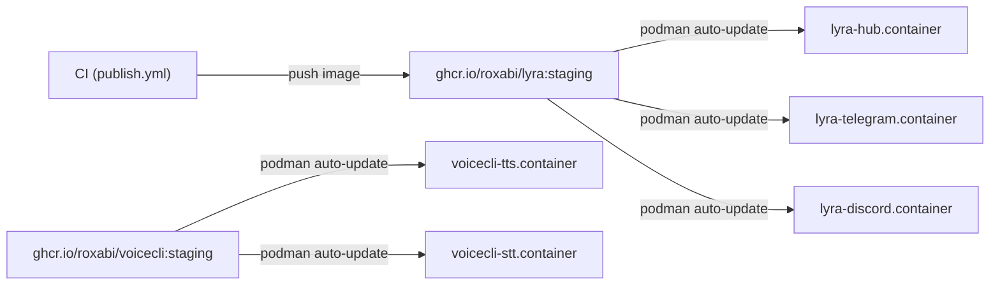

## Context

Promoted from [frame #929](../frames/929-close-ci-prod-auto-deploy-gap-frame.mdx). CI publishes `ghcr.io/roxabi/lyra:staging` on every staging merge, but prod (M₁) never pulls new images. Quadlet containers run stale layers until manual intervention.

## Goal

Every staging merge that publishes a new GHCR image is automatically deployed to prod within 5 minutes, with no manual intervention.

## Users

- **Primary:** Mickael (operator) — eliminates manual deploy friction
- **Secondary:** Lyra end users (Telegram/Discord) — receive fixes/features without delay

## Expected Behavior

1. Developer merges to `staging` → CI builds + pushes `ghcr.io/roxabi/lyra:staging`
2. On M₁, `podman-auto-update.timer` fires periodically (default: daily, override to 5min)
3. `podman auto-update` checks GHCR for each container with `AutoUpdate=registry` label
4. New image digest detected → podman pulls image, restarts the container
5. Adapters may restart before hub (podman auto-update restarts containers independently, ignoring Quadlet `After=` ordering). Adapters reconnect via NATS retry logic — transient disconnects are expected and self-healing.
6. Legacy deploy scripts and timer become dead code and are removed/deprecated

## Data Model & Consumers

| Consumer | Image | Current ref | Target ref | AutoUpdate |
|---|---|---|---|---|
| lyra-hub | lyra | `localhost/lyra:latest` (prod) | `ghcr.io/roxabi/lyra:staging` | `registry` |
| lyra-telegram | lyra | `localhost/lyra:latest` (prod) | `ghcr.io/roxabi/lyra:staging` | `registry` |
| lyra-discord | lyra | `localhost/lyra:latest` (prod) | `ghcr.io/roxabi/lyra:staging` | `registry` |
| voicecli-tts | voicecli | `ghcr.io/roxabi/voicecli:staging` (prod) | same | `registry` |
| voicecli-stt | voicecli | `ghcr.io/roxabi/voicecli:staging` (prod) | same | `registry` |
| lyra-nats | nats | pinned digest (prod) | same | none (pinned) |

## Breadboard

### Affordances

| ID | Element | Location |
|---|---|---|
| U1 | `AutoUpdate=registry` label | `.container` files (repo + prod) |
| U2 | `podman-auto-update.timer` override | `~/.config/systemd/user/podman-auto-update.timer.d/` on M₁ |
| U3 | GHCR auth | `podman login ghcr.io` on M₁ |

### Handlers

| ID | Handler | Triggered by |
|---|---|---|
| N1 | `podman auto-update` | systemd timer (U2) |
| N2 | Quadlet restart | podman detects new digest (N1) |

### Data

| ID | Store | Accessed by |
|---|---|---|
| S1 | GHCR image registry | N1 (pull check) |
| S2 | Podman local image store | N2 (container restart) |

### Wiring

U3 (GHCR auth) must be satisfied before N1 can reach S1. U2 fires → N1 authenticates via U3, checks S1 for each container with U1 → new digest → pull to S2 → N2 restarts container.

## Slices

| # | Slice | Deliverable | Demo |
|---|---|---|---|
| 1 | GHCR auth + image ref fix | `podman login ghcr.io` on M₁ (one-time, stores to `~/.config/containers/auth.json`); update lyra `.container` files `Image=` from `localhost/lyra:latest` to `ghcr.io/roxabi/lyra:staging` on prod | `podman pull ghcr.io/roxabi/lyra:staging` succeeds on M₁ |
| 2 | AutoUpdate label + timer | Add `Label=io.containers.autoupdate=registry` to all 5 `.container` files (lyra×3 + voicecli×2); enable `podman-auto-update.timer` with 5min drop-in | Push a no-op commit to lyra staging → image auto-deployed within 5min; repeat for voicecli |
| 3 | Legacy cleanup | Remove/deprecate dead deploy scripts + timer | `lyra-deploy.timer` disabled, `deploy.sh` archived |

## Success Criteria

- [ ] All 5 `.container` files on prod (M₁) have `Image=ghcr.io/roxabi/<project>:staging` (lyra×3, voicecli×2)
- [ ] All 5 `.container` files on prod have `AutoUpdate=registry` label
- [ ] `podman-auto-update.timer` is enabled on M₁ with ≤5min interval
- [ ] GHCR auth is configured on M₁ (`podman login ghcr.io` returns success)
- [ ] A staging merge triggers CI image publish → prod auto-pulls within 5min (end-to-end, manual verification on M₁)
- [ ] Adapter containers recover within 30s after an unordered restart (NATS reconnect)
- [ ] `lyra-deploy.timer` is disabled on M₁
- [ ] Legacy `scripts/deploy.sh` is removed or clearly marked deprecated
- [ ] `docs/ops/container-publishing.md` documents the auto-update flow

## Edge Cases

- **PAT expiry:** GHCR auth uses a classic PAT with `read:packages`. If it expires, auto-update silently stops pulling (container stays on old image). Follow-up: add PAT expiry monitoring or use a non-expiring token.
- **Image fails to start:** Podman does not auto-rollback. Container enters restart loop (`Restart=on-failure`). Operator sees it via `podman ps` / `journalctl`. Follow-up: deploy failure alerting.
- **Auth failure vs image-not-found:** Both surface as pull errors in `journalctl --user -u podman-auto-update`. Distinguishable by error message but not by exit code.

## Out of Scope

- Containerizing roxabi-live (separate issue)
- Blue/green or rolling deployments
- Deploy failure alerting (follow-up — silent pull failures reproduce the original incident; acceptable for now given sole-operator context and `journalctl` visibility)
- NATS container management (pinned by digest, managed independently)
