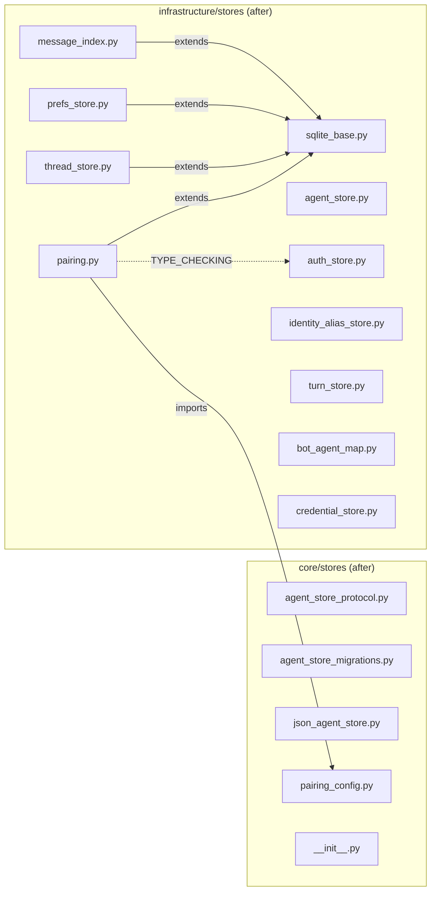

## Context

ADR-048 designates `lyra.infrastructure.stores` as the home for all SQLite implementations. Four files remain in `core/stores/` with illegal outward imports to `infrastructure/`. This spec covers moving them and updating all import sites.

## Goal

Eliminate all core → infrastructure layer violations so import-linter passes without any ADR-048-transitional ignore entries.

## Users

- **Primary:** Lyra maintainers — clean layer enforcement via import-linter
- **Secondary:** Contributors — consistent store placement

## Expected Behavior

After migration:
1. `core/stores/` contains only protocols, pure config, and factory functions (no SQLite imports)
2. `infrastructure/stores/` contains all SQLite implementations
3. `import-linter` passes with zero transitional ignore entries for Direction 1
4. All existing tests pass without modification beyond import path updates

## Data Model & Consumers

### Consumer Summary

| Consumer | Imports from | New import path |
|----------|-------------|-----------------|
| `bootstrap/bootstrap_stores.py` | `message_index`, `prefs_store` | `lyra.infrastructure.stores.*` |
| `bootstrap/factory/hub_builder.py` | `prefs_store`, `pairing` | `lyra.infrastructure.stores.*` |
| `bootstrap/wiring/bootstrap_wiring.py` | `thread_store` | `lyra.infrastructure.stores.thread_store` |
| `bootstrap/standalone/adapter_standalone.py` | `thread_store` | `lyra.infrastructure.stores.thread_store` |
| `bootstrap/standalone/hub_standalone_helpers.py` | `pairing` | `lyra.infrastructure.stores.pairing` |
| `bootstrap/lifecycle/bootstrap_lifecycle.py` | `pairing` | `lyra.infrastructure.stores.pairing` |
| `bootstrap/factory/unified.py` | `pairing` | `lyra.infrastructure.stores.pairing` |
| `bootstrap/factory/config.py` | `pairing_config` | unchanged (stays in core) |
| `adapters/discord/adapter.py` | `thread_store` | `lyra.infrastructure.stores.thread_store` |
| `adapters/discord/discord_threads.py` | `thread_store` | `lyra.infrastructure.stores.thread_store` |
| `commands/pairing/handlers.py` | `pairing` | `lyra.infrastructure.stores.pairing` |
| `tests/core/conftest.py` | `pairing` | `lyra.infrastructure.stores.pairing` |
| `tests/core/test_pairing_core.py` | `pairing` | `lyra.infrastructure.stores.pairing` |
| `tests/core/test_pairing_commands.py` | `pairing` | `lyra.infrastructure.stores.pairing` |
| `tests/core/test_prefs_alias.py` | `prefs_store` | `lyra.infrastructure.stores.prefs_store` |
| `tests/core/test_prefs_store.py` | `prefs_store` | `lyra.infrastructure.stores.prefs_store` |
| `tests/core/test_message_index.py` | `message_index` | `lyra.infrastructure.stores.message_index` |
| `tests/core/test_submit_middleware_context.py` | `message_index` | `lyra.infrastructure.stores.message_index` |

## Breadboard

### Files to move

| ID | File (current) | Destination | Why |
|----|---------------|-------------|-----|
| F1 | `core/stores/message_index.py` | `infrastructure/stores/message_index.py` | SQLite impl, imports SqliteStore |
| F2 | `core/stores/prefs_store.py` | `infrastructure/stores/prefs_store.py` | SQLite impl, imports SqliteStore |
| F3 | `core/stores/thread_store.py` | `infrastructure/stores/thread_store.py` | SQLite impl, imports SqliteStore |
| F4 | `core/stores/pairing.py` | `infrastructure/stores/pairing.py` | SQLite impl, imports SqliteStore + AuthStore |

### Files to stay in core/stores

| ID | File | Why |
|----|------|-----|
| S1 | `pairing_config.py` | Pure pydantic models + constants, no SQLite imports |
| S2 | `agent_store_protocol.py` | Protocol definition (TYPE_CHECKING imports only — already ignored) |
| S3 | `agent_store_migrations.py` | Out of scope (Direction 2) |
| S4 | `json_agent_store.py` | JSON-based, no SQLite |
| S5 | `__init__.py` | Package exports |

### Wiring changes

| ID | Action |
|----|--------|
| W1 | Update `pairing.py` relative import `from .pairing_config` → absolute `from lyra.core.stores.pairing_config` |
| W2 | Update `infrastructure/stores/__init__.py` to export `MessageIndex`, `PrefsStore`, `UserPrefs`, `ThreadStore`, `PairingManager`, `PairingError`, etc. |
| W3 | Update 18 external import sites (see consumer table) |
| W4 | Remove 6 Direction-1 ignore entries from `.importlinter` (lines 18–23; line 17 `agent_store_protocol` stays — file remains in core) |
| W5 | Verify `src/lyra/core/CLAUDE.md` line 59 (`pairing_config.py` note) still accurate post-move — no update expected |

## Slices

| # | Slice | Files | Demo |
|---|-------|-------|------|
| 1 | Move stores + update imports | F1–F4, W1–W3, W5 | `uv run ruff check .` passes, `uv run pytest` passes (import-linter still has stale ignore entries — cleaned in slice 2) |
| 2 | Clean import-linter config + verify | W4 | Remove 6 stale ignore entries → `uv run lint-imports` passes with zero Direction-1 transitional ignores |

## Success Criteria

- [ ] `message_index.py`, `prefs_store.py`, `thread_store.py`, `pairing.py` exist in `infrastructure/stores/`
- [ ] No copies remain in `core/stores/`
- [ ] All 18 external import sites updated to `lyra.infrastructure.stores.*`
- [ ] `pairing.py` uses absolute import for `pairing_config` from `core/stores`
- [ ] `infrastructure/stores/__init__.py` exports the 4 moved modules' public symbols
- [ ] 6 Direction-1 ignore entries removed from `.importlinter` (lines 18–23; line 17 stays)
- [ ] `uv run ruff check .` passes
- [ ] `uv run pytest` passes (all existing tests green)
- [ ] `uv run lint-imports` passes with zero layer violations
