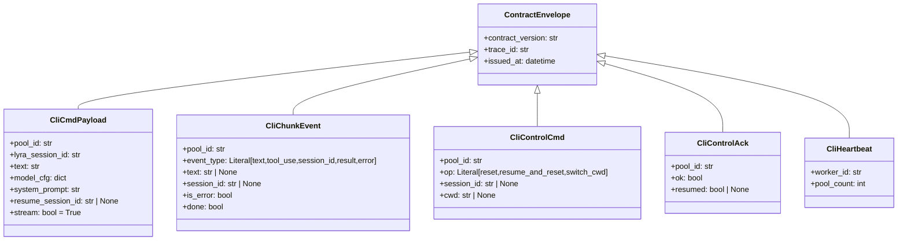
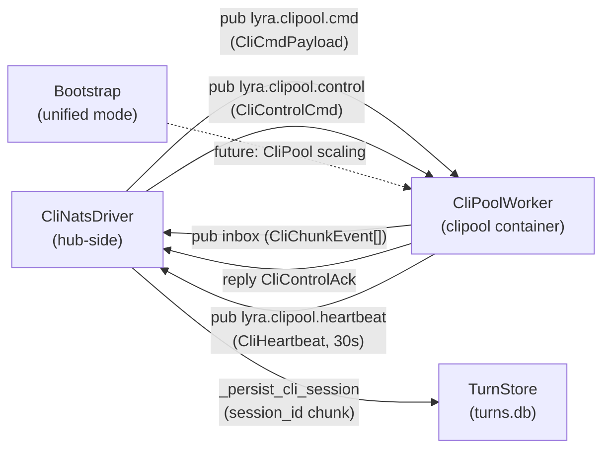

## Context

Promoted from: `artifacts/analyses/941-extract-clipool-dedicated-container-nats-analysis.mdx`
Frame: `artifacts/frames/941-extract-clipool-dedicated-container-nats-frame.mdx`

Shape selected: **Shape 1 — Thin CLI worker wrapping CliPool**.

**Subject correction vs analysis:** Flat subjects (`lyra.clipool.cmd`, `lyra.clipool.control`,
`lyra.clipool.heartbeat`) replace the per-pool-id pattern from the architecture doc.
Rationale: flat subjects + queue group enable future multi-instance scaling with zero
subject changes; per-pool-id subjects would require dynamic subscriptions and break
`NatsAdapterBase`'s single-subject queue-group model. `pool_id` is routed via payload.
`container-split.md` NATS Topics table must be updated.

**`CliPool` API:** Frozen — no changes to `CliPool` internals or public interface in this issue.
`CliPoolWorker` consumes `CliPool` as-is.

**`roxabi-contracts` (S1):** Lives in a separate package/repo. S1 requires its own PR in
`roxabi-contracts` and a version bump consumed by `lyra` before S2/S3 can land.

## Goal

Replace the in-process `ClaudeCliDriver → CliPool` boundary with a NATS cmd/reply protocol,
running CliPool in a dedicated `lyra-clipool` container with its own `~/.claude/` volume.

## Users

**Primary:** Lyra platform operator — deploys and restarts containers independently.
**Secondary:** Lyra end-users (Telegram / Discord) — transparent if session continuity holds.

## Expected Behavior

1. Hub receives a user message and calls `CliNatsDriver.stream(pool_id, text, ...)`.
2. `CliNatsDriver` creates an ephemeral inbox, subscribes to it, and publishes
   `CliCmdPayload` to `lyra.clipool.cmd` with `reply=inbox`.
3. `CliPoolWorker` receives the message, extracts `pool_id`, calls
   `CliPool.send_streaming(pool_id, ...)`, and fans each `LlmEvent` back to `msg.reply`
   as a `CliChunkEvent`.
4. On the first `system/init` event from Claude, the worker emits
   `CliChunkEvent(event_type="session_id", session_id="...")`. Hub fires
   `_persist_cli_session()` → TurnStore updated.
5. Hub streams `LlmEvent` objects to the adapter; user sees tokens arriving.
6. Final `CliChunkEvent(event_type="result", done=True)` closes the stream.
7. On hub restart, next turn: hub looks up `cli_sid` from TurnStore, sends
   `resume_session_id` in `CliCmdPayload` → worker schedules `--resume` on next spawn →
   Claude loads `~/.claude/projects/<cwd>/<cli_sid>.jsonl`.
8. Control ops (`reset`, `resume_and_reset`, `switch_cwd`) publish to
   `lyra.clipool.control` and receive `CliControlAck` synchronously.
9. `lyra start` (unified mode): `CliPoolWorker` starts as an asyncio background task
   alongside embedded NATS. Hub wires `CliNatsDriver` against local NATS — single code path.

## Data Model & Consumers

**Consumer summary:**

| Consumer | Fields | When | Status |
|----------|--------|------|--------|
| `CliPoolWorker` | `pool_id`, `text`, `model_cfg`, `system_prompt`, `resume_session_id`, `stream` | On turn submission | This issue |
| `CliNatsDriver` | `pool_id`, `event_type`, `text`, `session_id`, `is_error`, `done` | On chunk receipt | This issue |
| `CliNatsDriver._persist_cli_session` | `session_id` | On `event_type=session_id` chunk | This issue |
| `_worker_freshness` dict | `worker_id` | On heartbeat | This issue |
| Multi-instance load balancer | `pool_count` | Future | Out of scope |

## Breadboard

### Data Plane (turn submission)

| Affordance | Handler | Data effect |
|-----------|---------|------------|
| U1: `CliNatsDriver.stream(pool_id, text, model_cfg, system_prompt)` | N1: Worker receives `CliCmdPayload` on `lyra.clipool.cmd`; calls `CliPool.send_streaming(pool_id, ...)` | `CliChunkEvent[]` → ephemeral inbox → `AsyncIterator[LlmEvent]` |
| U2: `CliNatsDriver.complete(pool_id, text, model_cfg, system_prompt)` | N2: Worker receives `CliCmdPayload(stream=False)`; calls `CliPool.send(pool_id, ...)` | Single `CliChunkEvent(done=True)` → `LlmResult` |

### Control Plane

| Affordance | Handler | Data effect |
|-----------|---------|------------|
| U3: `CliNatsDriver.reset(pool_id)` | N3: `CliControlCmd(op=reset)` → `CliPool.reset(pool_id)` | `CliControlAck(ok=True)` |
| U4: `CliNatsDriver.resume_and_reset(pool_id, session_id)` | N4: `CliControlCmd(op=resume_and_reset)` → `CliPool.resume_and_reset(pool_id, sid)` | `CliControlAck(ok=True, resumed=bool)` |
| U5: `CliNatsDriver.switch_cwd(pool_id, cwd)` | N5: `CliControlCmd(op=switch_cwd)` → `CliPool.switch_cwd(pool_id, cwd)` | `CliControlAck(ok=True)` |
| U6: `CliNatsDriver.is_alive(pool_id)` | N6: Check `_worker_freshness` by `worker_id` (not by `pool_id`); threshold 60s | `bool` (no NATS call) — worker-level liveness only; `pool_id` arg is ignored in initial impl |

### Heartbeat

| Affordance | Handler | Data effect |
|-----------|---------|------------|
| — (background) | N7: Worker publishes `CliHeartbeat` to `lyra.clipool.heartbeat` every 30s | `_worker_freshness` dict updated in `CliNatsDriver` |

### Subject Map (updated — flat, no per-pool-id)

| Subject | Direction | Publisher | Subscriber |
|---------|-----------|-----------|------------|
| `lyra.clipool.cmd` | Hub → Worker | `CliNatsDriver` | `CliPoolWorker` (queue: `clipool-workers`) |
| `<ephemeral inbox>` | Worker → Hub | `CliPoolWorker` | `CliNatsDriver` (per-request inbox) |
| `lyra.clipool.control` | Hub → Worker | `CliNatsDriver` | `CliPoolWorker` via `_extra_subjects()` |
| `lyra.clipool.heartbeat` | Worker → Hub | `CliPoolWorker` heartbeat loop | `CliNatsDriver` heartbeat sub |

## Slices

| # | Name | Affordances covered | Depends on | Demo |
|---|------|--------------------|-----------:|------|
| S1 | `roxabi-contracts` cli/ domain | — (data models only) | — | `python -c "from roxabi_contracts.cli.models import CliCmdPayload"` |
| S2 | `CliPoolWorker` + `lyra adapter clipool` entrypoint | N1–N7 (worker side) | S1 | `lyra adapter clipool` starts, subscribes, publishes heartbeat |
| S3 | `CliNatsDriver` + prod bootstrap (3-process mode) | U1–U6, hub wiring | S1, S2 | End-to-end turn via `lyra hub` + `lyra adapter clipool` + NATS |
| S4 | Unified mode (`lyra start` asyncio task) | all via in-proc NATS | S2, S3 | `lyra start` completes a full turn |
| S5 | Container infra (Quadlet + nkey + volume migration) | deployment | S2, S3 | `lyra-clipool.container` starts, hub detects heartbeat within 30s |

> **Smart splitting note:** |slices| = 5 > 3. S1 touches a separate package
> (`roxabi-contracts`) but is small (~80 LOC) and tightly coupled to the feature.
> Recommendation: keep as a single issue — slices are sequential dependencies, not
> parallel workstreams.

## Success Criteria

- [ ] `lyra adapter clipool` starts, connects to NATS with a valid nkey, and publishes a
  `CliHeartbeat` to `lyra.clipool.heartbeat` within 5s of startup; hub `CliNatsDriver`
  marks worker alive within 60s.
- [ ] A full streaming turn (hub → `lyra.clipool.cmd` → worker → inbox chunks → hub)
  delivers all `text`, `tool_use`, and `result` `CliChunkEvent`s with correct `pool_id`.
- [ ] A `session_id` chunk is emitted by the worker and persisted to `TurnStore` within
  the same turn; `turns.db` row `cli_session_id` is non-null after the turn completes.
- [ ] When `resume_session_id` is set in `CliCmdPayload`, the worker passes `--resume <sid>`
  to the Claude subprocess; the worker emits a `CliChunkEvent(event_type="session_id",
  session_id=<sid>)` and the resumed `turns.db` row `cli_session_id` matches `<sid>`.
- [ ] All three control ops (`reset`, `resume_and_reset`, `switch_cwd`) return
  `CliControlAck(ok=True)` within 5s under normal conditions.
- [ ] `lyra-hub.container` has zero `~/.claude/` `Volume=` lines; all eight mounts
  (`.credentials.json`, `settings.json`, `settings.local.json`, `CLAUDE.md`, `projects`,
  `plugins`, `skills`, `shared`) appear in `lyra-clipool.container`.
- [ ] `lyra start` (unified mode) completes a full round-trip turn without error; no
  direct `CliPool(...)` instantiation remains in `bootstrap/factory/unified.py` or
  `bootstrap/factory/hub_builder.py` (both moved to `CliPoolWorker` ownership).
- [ ] Hub restart simulation: kill and restart `lyra-hub` within 30s of an active
  conversation; next turn from same user resumes the correct Claude session (no cold
  start); `_resume_session_ids` rebuilt from TurnStore lookup in
  `CliCmdPayload.resume_session_id`.
- [ ] Mid-stream `CliPoolWorker` failure (simulated): hub inbox times out within 30s
  and surfaces a recoverable error to the adapter (not a silent hang); no zombie
  inbox subscriptions remain.

## Infrastructure Notes (for S5 spec)

- **nkey provisioning (hard blocker):**
  1. Generate keypair: `nk -gen user` → save seed file as `~/.lyra/nkeys/clipool-worker.seed`
  2. Add public key to `deploy/nats/nats-container.conf` auth block (alongside hub / adapters)
  3. Declare secret in `lyra-clipool.container`:
     `Secret=lyra-nkey-clipool-worker,type=mount,target=clipool-worker.seed,mode=0400,uid=1500,gid=1500`
  4. Set env: `Environment=NATS_NKEY_SEED_PATH=/run/secrets/clipool-worker.seed`
  5. Provision via `make quadlet-secrets-install`
- **Startup order:** `After=lyra-nats.service` (no `Requires=`) — clipool connects to NATS
  directly; hub restarts must not cascade to clipool.
- **Volume exclusion:** `lyra-clipool.container` must NOT mount `lyra-data.volume`
  (`~/.lyra/`). Add explicit comment in quadlet to prevent cargo-cult copy.
- **CPU quota:** Start with `CPUQuota=400%` (provisional; Claude subprocesses are
  CPU-heavy vs hub's `200%`). Review after first week in prod; adjust if host contention
  observed.
- **Image:** Reuse `ghcr.io/roxabi/lyra:staging`, entrypoint `lyra adapter clipool`.

## Docs to update

- `docs/architecture/container-split.md` §NATS Topics: replace per-pool-id subjects with
  flat subjects + note ephemeral inbox semantics for replies.
