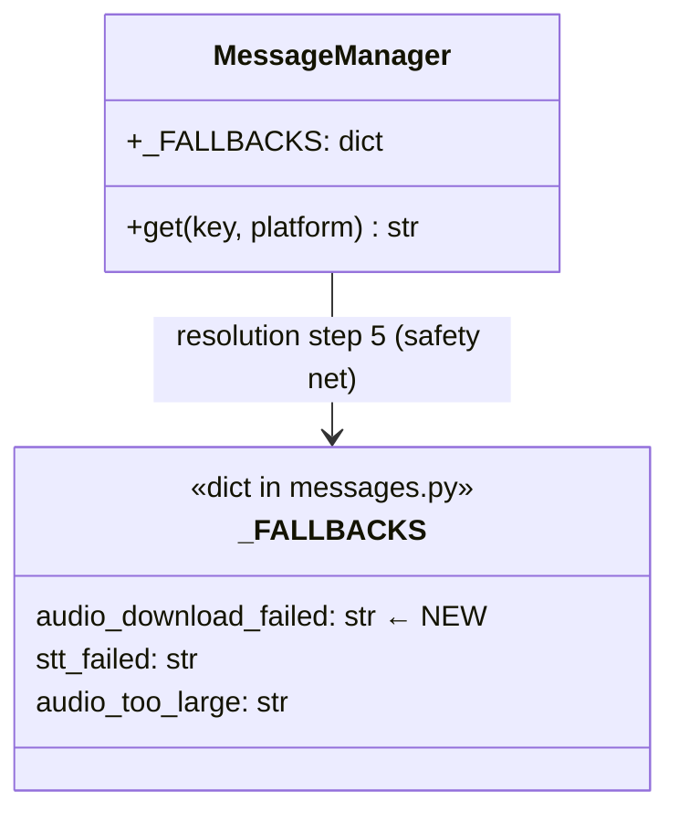
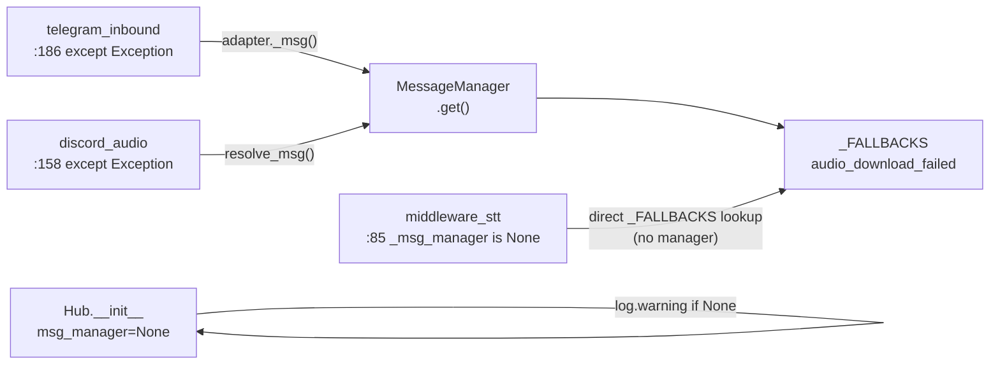

## Context

Promoted from `artifacts/frames/945-audio-download-silent-failure-frame.mdx` (approved 2026-04-27).

Both adapter download paths (`telegram_inbound.py:186`, `discord_audio.py:158`) catch generic exceptions, log, and return silently — no user reply. The `audio_too_large` and `audio_invalid_format` paths already reply correctly; this is an asymmetric gap in the `except Exception` fallthrough. A secondary silent-drop exists in `SttMiddleware:85` when `hub._msg_manager is None`.

**Audit finding (pre-spec):** 15+ test fixtures call `Hub()` without `msg_manager`. Hard `RuntimeError` at init is out of scope for this issue — deferred to a follow-up cleanup. S4 is scoped to `log.warning` visibility only.

## Goal

Every voice message download failure sends a user-facing error reply instead of silently disappearing. The STT middleware silent-drop when `_msg_manager is None` is replaced by a hardcoded-fallback reply.

## Users

- **Primary:** Telegram and Discord users who send voice/audio messages during transient download failures (network blip, API timeout, CDN error).
- **Secondary:** Operators — currently no distinction between "received + processed" and "received + silently dropped".

## Expected Behavior

1. User sends a voice message on Telegram or Discord.
2. The adapter attempts to download the audio file.
3. Download raises any non-`ValueError` exception. (`ValueError` is already handled upstream as `audio_too_large` and `audio_invalid_format` — those paths are unchanged.)
4. Adapter catches the exception, logs it (existing `log.exception(...)` call preserved), **and** sends the user a reply using the `audio_download_failed` template.
5. User sees: *"Couldn't retrieve your audio file. Please try again."* (fallback text, overridable via TOML).
6. Message processing stops; no STT is attempted.

Secondary: if `hub._msg_manager is None` in `SttMiddleware`, a reply is sent using the `_FALLBACKS["audio_download_failed"]` hardcoded string instead of silently dropping.

## Out of Scope

- Making `Hub._msg_manager` mandatory at construction time (deferred — requires updating 15+ test fixtures).
- `LyraUserError` typed exception hierarchy (arch follow-up, ADR-058).
- `ErrorBoundaryMiddleware` as pipeline-level safety net (arch follow-up).
- Retry logic for transient download failures.
- Metrics/alerting for download failure rate.
- NATS and CLI adapters (no audio download path).

## Data Model & Consumers

| Consumer | Fields consumed | When | Status |
|---|---|---|---|
| `telegram_inbound.py` | `audio_download_failed` via `adapter._msg()` | download `except Exception` | this issue |
| `discord_audio.py` | `audio_download_failed` via `resolve_msg()` | `attachment.read()` `except Exception` | this issue |
| `middleware_stt.py` | `_FALLBACKS["audio_download_failed"]` direct | `_msg_manager is None` guard | this issue |
| `Hub.__init__` | `msg_manager is None` check | construction time | this issue (log.warning only) |

## Breadboard

| Affordance | Handler | Data |
|---|---|---|
| U1: voice message received | `telegram_inbound` / `discord_audio` entry | `InboundMessage.modality == "voice"` |
| U2: download raises `Exception` (non-`ValueError`) | `except Exception` block in each adapter | exception, `file_id`/`message_id`, `user_id` |
| N1: log exception | `log.exception(...)` | existing call — unchanged |
| N2: build reply text | `adapter._msg("audio_download_failed", fallback)` / `resolve_msg(...)` | `_FALLBACKS["audio_download_failed"]` |
| N3: send reply to user | `bot.send_message(...)` / `message.reply(...)` | reply text, `chat_id`, `message_id` |
| N4: reply-send failure | inner `except Exception` → `log.warning(...)` | mirrors `audio_too_large` pattern exactly |
| N5: STT guard (`_msg_manager is None`) | import `_FALLBACKS` directly → `dispatch_response` | hardcoded fallback string, no manager needed |
| N6: Hub init warning | `log.warning("Hub._msg_manager is None …")` | ops visibility without breaking callers |

## Slices

Ordering dependency: **S5 requires S4** (guard removal safe only after hub always carries a manager in production; for now S5 ships concurrently since it uses `_FALLBACKS` directly, not `_msg_manager`).

| # | Slice | Files | Independently demo-able |
|---|---|---|---|
| S1 | Add `audio_download_failed` to `_FALLBACKS` | `src/lyra/core/messaging/messages.py` | Yes — `MessageManager.get("audio_download_failed")` returns string |
| S2 | Fix Telegram download silent failure | `src/lyra/adapters/telegram/telegram_inbound.py` | Yes (requires S1) |
| S3 | Fix Discord download silent failure | `src/lyra/adapters/discord/discord_audio.py` | Yes (requires S1) |
| S4 | Add `log.warning` at Hub init when `msg_manager is None` | `src/lyra/core/hub/hub.py` | Yes — independent |
| S5 | Fix STT middleware silent drop — dispatch fallback reply | `src/lyra/core/hub/middleware/middleware_stt.py` | Yes (requires S1 for `_FALLBACKS` import) |

## Success Criteria

- [ ] `_FALLBACKS["audio_download_failed"]` exists in `src/lyra/core/messaging/messages.py` with a non-empty English string.
- [ ] When `_download_audio()` raises any non-`ValueError` exception in `telegram_inbound.py`, the user receives a reply with `audio_download_failed` text (unit test: mock to raise, assert reply sent).
- [ ] When `audio_attachment.read()` raises in `discord_audio.py`, the user receives a reply with `audio_download_failed` text (unit test: mock to raise, assert reply sent).
- [ ] The `audio_too_large` and `audio_invalid_format` reply paths in both adapters are unchanged (no regression).
- [ ] If the error reply itself fails to send, a `log.warning(...)` is emitted and processing continues without raising (mirrors the existing `audio_too_large` inner-except pattern).
- [ ] When `hub._msg_manager is None` in `SttMiddleware`, a reply is dispatched using the hardcoded `audio_download_failed` fallback string instead of silently returning `_DROP`.
- [ ] `Hub.__init__` emits `log.warning(...)` when `msg_manager is None` (not RuntimeError — breaking change deferred).
- [ ] All existing STT middleware tests pass unchanged.
- [ ] `uv run ruff check .` and `uv run pyright` pass with no new errors.
