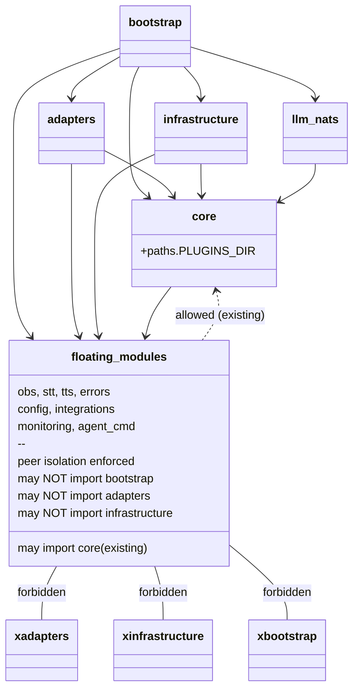
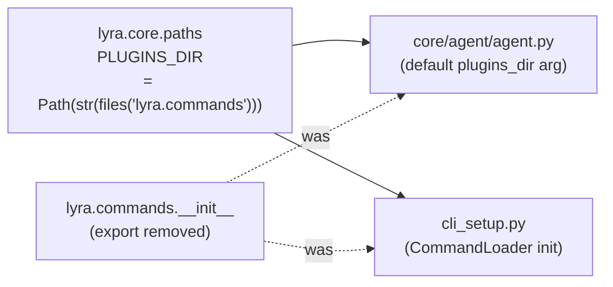

## Context

Promoted from `artifacts/analyses/977-hexagonal-arch-structural-audit-analysis.mdx`.
Shape 3 selected: surgical fixes + importlinter closed-namespace guardrail. No file moves, no namespace restructure.

Five violations found in full audit. Four are in scope here; the 23 `core→infrastructure` exemptions are blocked on #935.

## Goal

Fix all four in-scope structural violations of Lyra's declared hexagonal architecture so that CI enforces the layer model durably without moving or renaming any module.

## Users

- **Primary:** all contributors — structural violations compound silently as the codebase grows; CI should catch them immediately
- **Secondary:** downstream consumers of `roxabi-nats` and `roxabi-contracts` — independent versioning requires a clean package graph (quality gates covering `packages/` is a prerequisite)

## Expected Behavior

**Before:**
- `core/agent/agent.py:18` imports `from lyra.commands import PLUGINS_DIR` — domain layer reaches into application layer; `import-linter` doesn't catch it because `lyra.commands` is not a registered layer
- 8 modules (`obs/`, `stt/`, `tts/`, `errors.py`, `config.py`, `integrations/`, `monitoring/`, `agent_cmd/`) have no position in the `.importlinter` contract; no peer-isolation or upper-boundary rules enforced
- `packages/roxabi-nats/src/roxabi_nats/_serialize.py` is 318 lines — `check-file-length` never runs on `packages/`
- `tools/file_exemptions.txt` contains a stale entry for `command_router.py` (file is now 297 lines, below the limit)

**After:**
- `lyra.core.paths` defines `PLUGINS_DIR`. Both `core/agent/agent.py` and `cli_setup.py` import from `lyra.core.paths`. `lyra.commands.__init__` no longer exports `PLUGINS_DIR`.
- `.importlinter` has two new contracts for the 8 floating modules:
  - `shared-modules-independence`: ensures the 8 modules don't import each other (peer isolation)
  - `shared-modules-upper-boundary`: `forbidden` contract ensuring none of the 8 import from `lyra.bootstrap`, `lyra.adapters`, or `lyra.infrastructure`
- Running `check-file-length` against `packages/roxabi-nats/src/` flags `_serialize.py` at 318 lines. The pre-push hook is extended to invoke `check_file_length.sh` twice — once for `src/` and once per package root (via `QG_FILE_ROOT` override).
- `tools/file_exemptions.txt` no longer contains the `command_router.py` entry.

## Data Model & Consumers

### Layer model (post-fix)

### Consumer map — `PLUGINS_DIR`

| Consumer | Field | When | Status |
|----------|-------|------|--------|
| `core/agent/agent.py` | `PLUGINS_DIR` (default arg) | Agent init | This issue |
| `cli_setup.py` | `PLUGINS_DIR` (CommandLoader) | CLI startup | This issue |

## Breadboard

### N1 — `lyra.core.paths` module

| Element | Handler | Data |
|---------|---------|------|
| `PLUGINS_DIR` constant | `Path(str(files("lyra.commands")))` | Resolves to `lyra/commands/` package dir — must point to `commands`, not `core` |
| Import in `core/agent/agent.py` | `from lyra.core.paths import PLUGINS_DIR` | replaces `from lyra.commands import PLUGINS_DIR` |
| Import in `cli_setup.py` | `from lyra.core.paths import PLUGINS_DIR` | replaces `from lyra.commands import PLUGINS_DIR` |
| `commands/__init__.py` | Remove `PLUGINS_DIR` export and `files()` import | cleanup only |

> `importlib.resources.files("lyra.commands")` is a metadata lookup — it does not trigger a Python import of `lyra.commands`. No import cycle is introduced by defining this in `lyra.core.paths`.

### N2 — importlinter `shared-modules` contracts

| Element | Handler | Data |
|---------|---------|------|
| `shared-modules-independence` | `type = independence` | Lists all 8 floating modules; enforces no cross-imports between them (peer isolation) |
| `shared-modules-upper-boundary` | `type = forbidden` | `source_modules` = 8 floating modules; `forbidden_modules` = `lyra.bootstrap lyra.adapters lyra.infrastructure` |
| CI check | `import-linter` pre-push hook | Fails on peer cross-imports or upward boundary violations |

> Note: the floating modules already import from `lyra.core` (e.g., `lyra.stt` imports `lyra.core.ports.stt`). The `independence` contract does not restrict `core` imports — that is intentional and correct. The `upper-boundary` contract only forbids imports from `bootstrap`, `adapters`, and `infrastructure`.

### N3 — quality gate extension to packages/

| Element | Handler | Data |
|---------|---------|------|
| Pre-push hook extension | Add two extra `check_file_length.sh` invocations with `QG_FILE_ROOT` override | One for `packages/roxabi-nats/src/`, one for `packages/roxabi-contracts/src/` |
| Exemption handling | Each invocation uses a package-local exemptions file (or no exemptions initially) | `_serialize.py` at 318 lines will be flagged — needs an exemption entry or split |
| `check_file_length.sh` | Unmodified — single-root, invoked multiple times | Does not support multi-root natively; workaround is multiple invocations |

> `stack.yml` drives `qg.conf` but does not support multiple roots in the current schema. `qg.conf` is not edited directly. The pre-push hook is extended manually in `.claude/settings.json` (or equivalent hook config) to invoke the script for each package root. This is a one-time explicit extension, not a schema change.

### N4 — housekeeping

| Element | Handler | Data |
|---------|---------|------|
| `tools/file_exemptions.txt` | Remove `command_router.py` line | File is 297 lines — below the 300-line threshold; exemption is stale |

## Slices

| # | Slice | Deliverable | Independently demo-able? |
|---|-------|-------------|--------------------------|
| 1 | Kernel inversion fix | `lyra.core.paths` defined; both callers updated; `commands/__init__` cleaned; `import-linter` green; `CommandLoader` still finds plugins | Yes |
| 2 | Floating modules guardrail | `shared-modules-independence` + `shared-modules-upper-boundary` contracts in `.importlinter`; `import-linter` passes | Yes |
| 3 | Quality gate extension | Pre-push hook extended; `check-file-length` runs on both package roots; `_serialize.py` flagged (needs exemption decision) | Yes |
| 4 | Housekeeping | `command_router.py` exemption removed; CI clean | Yes |

> Smart-split check: 4 slices (>3), but all are tooling/config in one domain, no runtime behavior difference, sequentially low-risk. No sub-issue split needed.

## Success Criteria

- [ ] `uv run lint-imports` exits 0 with no new `ignore_imports` entries in `.importlinter`
- [ ] `grep -r "from lyra.commands" src/lyra/core/` returns no matches
- [ ] `src/lyra/core/paths.py` exists; `python -c "from lyra.core.paths import PLUGINS_DIR; assert PLUGINS_DIR.name == 'commands'"` exits 0
- [ ] All 8 floating modules appear by name in the `shared-modules-independence` contract in `.importlinter`
- [ ] All 8 floating modules appear by name in the `shared-modules-upper-boundary` contract in `.importlinter`
- [ ] Running `QG_FILE_ROOT=packages/roxabi-nats/src/ bash tools/check_file_length.sh` exits non-zero (flags `_serialize.py` at 318 lines) or the file has been split/exempted with a documented rationale
- [ ] The pre-push hook invokes `check_file_length.sh` for `packages/roxabi-nats/src/` and `packages/roxabi-contracts/src/` (verifiable via hook config or CI run log)
- [ ] `tools/file_exemptions.txt` contains no entry for `command_router.py`
- [ ] `uv run pytest` exits 0
