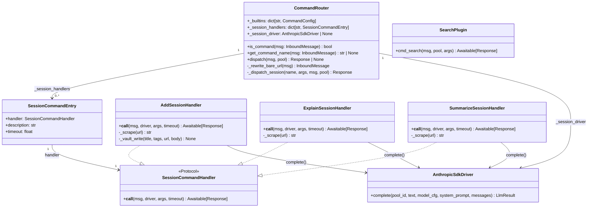
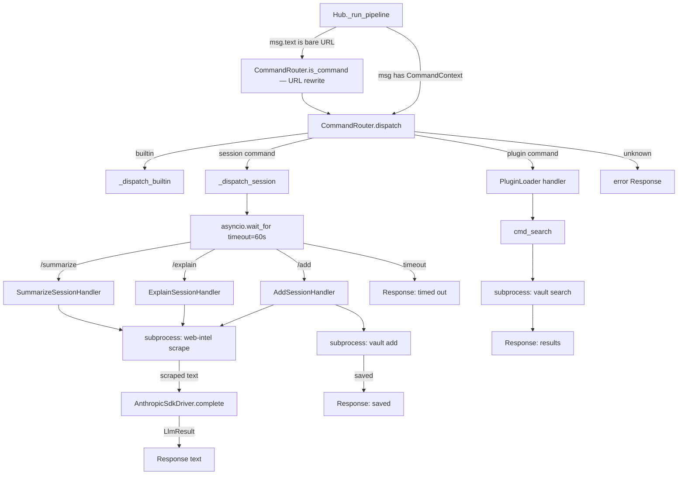

## Context

Promoted from: `artifacts/frames/99-hub-command-sessions-frame.mdx`
Architecture: `docs/ARCHITECTURE.md`

Lyra's `CommandRouter` dispatches `/` commands to stateless plugin handlers that return a `Response`
synchronously. This model works for `/svc status` or `/help` but cannot support commands like
`/add <url>`, `/explain`, and `/summarize` that need to (1) fetch and parse external URLs, (2) run
an LLM pass over the fetched content, and (3) optionally write results to vault — all I/O-bound,
all requiring an isolated LLM context.

Additionally, bare URLs typed without a `/` prefix are today routed to the main conversation pool
as free-text. This issue adds automatic `/add` rewriting for single bare URLs.

`/search` is vault FTS only — stateless, no LLM, implemented as a standard plugin command.

## Goal

Introduce a **session command** handler type in `CommandRouter`: an async handler that fires one
isolated `AnthropicSdkDriver` call per invocation, returns a `Response`, and discards all context.
Wire `/add`, `/explain`, `/summarize` as session commands. Wire `/search` as a plugin command.
Extend `CommandRouter.is_command()` to detect single bare URLs and rewrite them as `/add`.

## Users

- **Primary:** Mickael — saves URLs to vault daily via Telegram; needs `/add <url>` and `/search`
  as first-class commands.
- **Secondary:** Any Lyra user — the session command pattern is channel-agnostic (Telegram +
  Discord).

## Acceptance Criteria

### AC-1 — Bare URL detection and rewrite

- A message whose entire `text` field is a single bare URL (no `/` prefix, no other text) is
  treated as `/add <url>` by `CommandRouter.is_command()`.
- The URL is detected with a simple regex anchored to the full string: `^https?://\S+$`.
- `is_command()` returns `True` for such messages; `get_command_name()` returns `"/add"`.
- The rewrite is done inside `CommandRouter` by mutating a synthetic `CommandContext` on the
  message; the Hub's `run()` loop sees no change.
- Messages with text other than a bare URL (e.g., "check this https://example.com") are not
  rewritten; they continue to the pool as today.

### AC-2 — Session command dispatch path

- `CommandRouter` holds a `_session_handlers: dict[str, SessionCommandHandler]` registry
  alongside `_builtins` and plugin handlers.
- A `SessionCommandHandler` is a protocol / callable:
  `async (msg: InboundMessage, driver: AnthropicSdkDriver, args: list[str], timeout: float) -> Response`
- `dispatch()` checks session handlers after builtins and before plugin handlers.
- Session command execution is wrapped with `asyncio.wait_for(timeout=...)`.
  On timeout, returns `Response(content="Command timed out after {timeout:.0f}s.")`.
- The `AnthropicSdkDriver` instance is injected into `CommandRouter.__init__` as
  `session_driver: AnthropicSdkDriver | None = None`. If `None`, any session command returns
  `Response(content="Session commands require anthropic-sdk backend.")`.

### AC-3 — /add

- Registered as a session command.
- Requires one argument: a URL. Usage hint returned if absent.
- **Scrape:** runs `web-intel:scrape <url>` as a subprocess (`asyncio.create_subprocess_exec`).
  If `web-intel` is not on PATH, returns a graceful degradation message and the raw URL.
- **LLM summary:** calls `driver.complete()` with a task-specific system prompt requesting a
  structured summary (title, summary, tags). The `messages` list contains only the scraped
  content; no pool history is passed.
- **Vault write:** calls `vault add --title "..." --tags "..." --url <url> --body "..."` as a
  subprocess. If `vault` is not on PATH, logs a warning and returns the summary without writing.
- Returns a `Response` confirming save, or an error description on failure.
- Does **not** write to `pool.sdk_history` or `pool.history`.

### AC-4 — /explain

- Registered as a session command.
- Requires one argument: a URL. Usage hint returned if absent.
- **Scrape:** same subprocess pattern as `/add`.
- **LLM explanation:** calls `driver.complete()` with a system prompt requesting a plain-language
  explanation suitable for sharing in chat. No vault write.
- Returns the explanation as a `Response`.
- Does not touch pool history.

### AC-5 — /summarize

- Registered as a session command.
- Requires one argument: a URL. Usage hint returned if absent.
- **Scrape:** same subprocess pattern as `/add`.
- **LLM summary:** calls `driver.complete()` with a system prompt requesting a concise summary
  (3-5 bullet points). No vault write.
- Returns the summary as a `Response`.
- Does not touch pool history.

### AC-6 — /search

- Implemented as a **plugin command** (stateless, no LLM), not a session command.
- Manifest: `src/lyra/plugins/search/plugin.toml`; handler: `cmd_search` in
  `src/lyra/plugins/search/handlers.py`.
- Runs `vault search <query>` as a subprocess (same graceful degradation if absent).
- Returns top results formatted as a compact list.
- Does not interact with the pool beyond receiving `msg` and `pool` per the plugin contract.

### AC-7 — No history pollution

- Session commands receive a fresh `messages` list; they never read or write `pool.sdk_history`
  or `pool.history`.
- After the session command returns, the pool state is identical to before the command was
  dispatched.

### AC-8 — Timeout

- Default session command timeout: `60.0` seconds (configurable per command at registration time).
- Passed to `asyncio.wait_for`. On expiry, the `Response` carries a user-friendly timeout message.

### AC-9 — Graceful degradation

- `web-intel:scrape` not on PATH: return a message indicating scraping failed and offer the raw
  URL as fallback.
- `vault` CLI not on PATH: `/add` skips the vault write step and returns the LLM summary only,
  with a note that vault is unavailable.
- `session_driver` is `None`: return a clear error message; do not raise.

### AC-10 — /help listing

- Session commands appear in `/help` output under their own section heading: "Session commands:"
- Each entry shows the command name and a short description.

### AC-11 — Agent TOML wiring

- `AnthropicAgent` (and any `anthropic-sdk` backend agent) wires the existing `AnthropicSdkDriver`
  instance as `session_driver` when constructing `CommandRouter`.
- `SimpleAgent` (claude-cli backend) leaves `session_driver=None`; session commands return the
  degradation message.

## Breadboard

How the pieces connect at dispatch time:

```
InboundMessage (text="https://example.com")
        │
        ▼
Hub._run_pipeline()
        │
        ├── CommandParser.parse(msg.text)
        │     └── returns None  (no "/" prefix)
        │
        ├── CommandRouter.is_command(msg)
        │     └── _bare_url_regex.fullmatch(msg.text) → True
        │           └── synthesises CommandContext(prefix="/", name="add", args=url)
        │                 → attaches to msg.command  (immutable msg → replace())
        │           └── returns True
        │
        ▼
CommandRouter.dispatch(msg, pool)
        │
        ├── command_name = "/add"
        ├── args = [url]
        │
        ├── _session_handlers.get("/add") → SessionCommandHandler
        │
        ▼
asyncio.wait_for(
    session_handler(msg, self._session_driver, args, timeout=60.0),
    timeout=60.0
)
        │
        ├── subprocess: web-intel:scrape <url>  → scraped text
        │
        ├── driver.complete(
        │       pool_id="session:add",
        │       text=scraped_text,
        │       model_cfg=model_cfg,
        │       system_prompt=ADD_SYSTEM_PROMPT,
        │       messages=[{"role":"user","content":scraped_text}]
        │   ) → LlmResult
        │
        ├── subprocess: vault add ... → saved
        │
        └── Response(content="Saved: <title>")
                │
                ▼
        Hub._run_pipeline() returns Response
                │
                ▼
        OutboundDispatcher → adapter.send() → Telegram/Discord
```

```
InboundMessage (text="/search python asyncio")
        │
        ▼
CommandParser.parse() → CommandContext(prefix="/", name="search", ...)
CommandRouter.dispatch()
        ├── not a builtin, not a session command
        └── plugin_handlers.get("/search") → cmd_search(msg, pool, args)
                │
                ├── subprocess: vault search "python asyncio"
                └── Response(content="Results:\n...")
```

## Data Model & Consumers

### Class Diagram



### Consumer Flowchart



## Slices

Implementation order — each slice is independently testable and mergeable.

### S1 — Bare URL detection in CommandRouter (no LLM)

**Files:**
- `src/lyra/core/command_router.py` — add `_BARE_URL_RE` class constant; extend `is_command()` to
  call `_rewrite_bare_url()` when `msg.command is None` and the regex matches; add
  `_rewrite_bare_url()` private method that returns a new `InboundMessage` with a synthetic
  `CommandContext`.
- `tests/core/test_command_router.py` — test cases: bare HTTPS URL rewrites to `/add`; URL with
  surrounding text does not rewrite; HTTP URL rewrites; existing `/command` text not affected.

**Acceptance criteria covered:** AC-1

**Dependencies:** none

---

### S2 — SessionCommandEntry type + CommandRouter registry plumbing

**Files:**
- `src/lyra/core/command_router.py` — add `SessionCommandEntry` dataclass (handler, description,
  timeout); add `_session_handlers: dict[str, SessionCommandEntry]` and
  `session_driver: AnthropicSdkDriver | None` to `__init__`; add `register_session_command()`
  method; update `dispatch()` to check `_session_handlers` between builtins and plugins; add
  `_dispatch_session()` private method with `asyncio.wait_for`; update `_help()` to list session
  commands; update conflict guard to cover session command names.
- `tests/core/test_command_router.py` — test: session command is dispatched; timeout path returns
  timeout response; `session_driver=None` returns degradation message; `/help` includes session
  section.

**Acceptance criteria covered:** AC-2, AC-8, AC-9 (no driver), AC-10

**Dependencies:** S1

---

### S3 — Subprocess helpers: scrape + vault

**Files:**
- `src/lyra/core/session_helpers.py` (new) — two async functions:
  - `scrape_url(url: str, timeout: float) -> str`: runs `web-intel:scrape <url>`, returns stdout
    or raises `ScrapeFailed`. If binary not on PATH, raises `ScrapeFailed("not_available")`.
  - `vault_add(title: str, tags: list[str], url: str, body: str, timeout: float) -> None`:
    runs `vault add ...`, raises `VaultWriteFailed` on error or if binary absent.
  - `vault_search(query: str, timeout: float) -> str`: runs `vault search <query>`, returns
    stdout.
  - `ScrapeFailed` and `VaultWriteFailed` as simple exception classes.
- `tests/core/test_session_helpers.py` — test scrape happy path (mock subprocess); scrape PATH
  miss; vault_add happy path; vault_add PATH miss.

**Acceptance criteria covered:** AC-9 (graceful degradation), AC-3 (partial), AC-6 (partial)

**Dependencies:** none (parallel with S2)

---

### S4 — Session command handlers: /add, /explain, /summarize

**Files:**
- `src/lyra/core/session_commands.py` (new) — three `async` handler functions conforming to
  `SessionCommandHandler`:
  - `cmd_add(msg, driver, args, timeout)` — AC-3 logic
  - `cmd_explain(msg, driver, args, timeout)` — AC-4 logic
  - `cmd_summarize(msg, driver, args, timeout)` — AC-5 logic
  - Each uses `scrape_url()` and `driver.complete()` from S3; `cmd_add` also calls `vault_add()`.
  - System prompts defined as module-level constants: `ADD_SYSTEM_PROMPT`, `EXPLAIN_SYSTEM_PROMPT`,
    `SUMMARIZE_SYSTEM_PROMPT`.
  - `pool_id` passed to `driver.complete()` uses the convention `"session:<command>"` (e.g.,
    `"session:add"`) since there is no pool involved.
- `tests/core/test_session_commands.py` — test: add happy path (mock driver + scrape + vault);
  add with scrape failure; add with vault failure; explain happy path; summarize happy path;
  missing arg returns usage hint.

**Acceptance criteria covered:** AC-3, AC-4, AC-5, AC-7

**Dependencies:** S2, S3

---

### S5 — /search plugin

**Files:**
- `src/lyra/plugins/search/plugin.toml` (new) — plugin manifest; command `/search`; timeout 30s
- `src/lyra/plugins/search/__init__.py` (new, empty)
- `src/lyra/plugins/search/handlers.py` (new) — `cmd_search(msg, pool, args)`:
  joins args as query, calls `vault_search()` from `session_helpers`, formats and returns result.
- `tests/plugins/test_search.py` — test: search happy path; empty query hint; vault absent.

**Acceptance criteria covered:** AC-6

**Dependencies:** S3

---

### S6 — AnthropicAgent wiring + TOML config

**Files:**
- `src/lyra/agents/anthropic_agent.py` — pass `session_driver=self._provider` to
  `CommandRouter` constructor when building the router (inside `_build_router_kwargs()` or
  equivalent). `self._provider` is already the `AnthropicSdkDriver` instance.
- `src/lyra/agents/simple_agent.py` — no change needed; `session_driver` defaults to `None`.
- `src/lyra/agents/lyra.toml` — add `/add`, `/explain`, `/summarize`, `/search` to
  `[agent].enabled_plugins` or equivalent session command list (review TOML schema; add
  `session_commands` key if needed, or register them in code during agent construction).
- `tests/agents/test_anthropic_agent.py` — test: router built with `session_driver` set.

**Acceptance criteria covered:** AC-11

**Dependencies:** S4, S5

---

### S7 — Integration smoke test

**Files:**
- `tests/integration/test_command_sessions.py` (new) — end-to-end test using a mock
  `AnthropicSdkDriver` and mock subprocesses: bare URL → `/add` dispatch → response; `/explain
  <url>` → response; `/search <query>` → response; pool history unchanged after session command.

**Acceptance criteria covered:** AC-1 through AC-11 (smoke)

**Dependencies:** S1 through S6

## Out of Scope

- Persistent command sessions (pool-based, stateful across turns)
- Reply-to continuation sessions (smart reply threading) — follow-up issue
- `/search` with LLM ranking or synthesis — FTS only; LLM follow-up is via the main agent
- Per-command model selection in TOML — session always uses the agent's configured SDK model
- Cost tracking per session command
- Wiring vault and web-intel as native Anthropic SDK tools (tool schema is a separate concern)
- Multi-agent command conflict resolution
