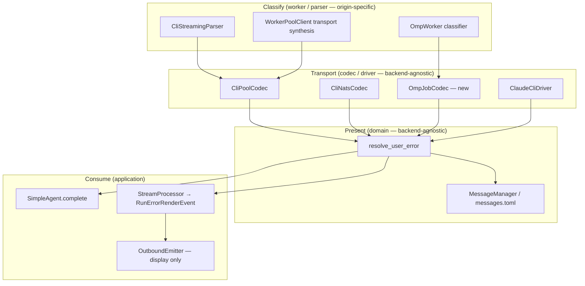

> **Current truth** → [`docs/architecture/architecture-patterns.md`](../architecture-patterns.md){#typed-error-boundary}
> Complements ADR-066 (WorkerError envelope), ADR-009 (GENERIC_ERROR_REPLY placement), ADR-058 (typed error boundary for inbound/audio). This ADR covers **LLM backend soft errors** only.

## Status

Accepted

## Context

Phase 1 (#1941) stopped silent empty replies by routing them through `GENERIC_ERROR_REPLY`.
Users now see a message, but it is often wrong: quota limits, auth failures, and other
curated CLI errors are classified correctly at the worker boundary (`CliStreamingParser`
→ `WorkerError`) yet discarded before display.

Investigation (2026-06-18) identified fragmented consumption:

| Site | Problem |
|------|---------|
| `agents/simple_agent.py` | Blocking path: only `"Timeout"` in `result.error` gets a specific template; ignores `LlmResult.worker_error` |
| `adapters/clipool/clipool_worker.py` | Blocking path: forwards `is_error` but not `worker_error` or error text on the NATS chunk |
| `llm/drivers/omp_rpc.py` | Drops `JobResult.error: WorkerError`; returns opaque `"omp worker returned an error"` |
| `outbound/_emitter_run.py` | Streaming path: sets `is_error_pending` from `RunErrorRenderEvent` but does not store `.message`; soft errors with no `text_delta` fall through to `GENERIC_ERROR_REPLY` |
| `outbound/error_handler.py` | Correctly scoped to **infra** stream exceptions only — must not absorb LLM soft errors |

Lyra runs multiple LLM backends behind the same `LlmProvider` port:

- **clipool** (NATS worker) — `LlmClient` + `CliPoolCodec`
- **claude-cli** (in-process) — `ClaudeCliDriver` over `CliPool`
- **omp-rpc** — `OmpRpcDriver` over `JobResult`

ADR-066 established `WorkerError` + `KNOWN_CODES` on NATS reply envelopes and planned a
hub-side helper at `core/messaging/error_extractor.py`. That module extracts
`worker_error` from envelopes but does **not** resolve user-facing text. ADR-066 also
deferred adapter i18n via `code` lookup to a follow-up epic — this ADR is that follow-up
for the LLM path.

## Options Considered

### Option A: Per-backend user messages in workers (clipool, omp)

Each worker maps errors to final user-facing strings before publishing on NATS.

- **Pros:** Hub stays thin; workers know their protocol best.
- **Cons:** i18n duplicated per worker and per platform locale; Telegram/Discord would
  need locale passed down the NATS wire; violates hexagonal layering (presentation in
  adapters); OMP and clipool would diverge on wording for the same `llm.rate_limit` code.

### Option B: Per-consumption-site ad hoc mapping (status quo extended)

Add `if "weekly limit" in error` in `SimpleAgent`, similar checks in `StreamProcessor`,
and OMP-specific strings in `OmpRpcDriver`.

- **Pros:** Fast local fixes.
- **Cons:** N backends × 2 consumption paths (blocking + streaming) = combinatorial
  drift; security risk (raw upstream text leaked without central scrub policy); already
  proven insufficient.

### Option C: Single domain resolver + worker classification only (chosen)

Workers and codecs **classify** into `WorkerError` (code + scrubbed message). A single
`resolve_user_error()` in `core/messaging/utils/` **presents** the error using
`MessageManager` templates and a passthrough allowlist. All `LlmProvider` implementations
converge on `LlmResult.worker_error` before the resolver runs.

- **Pros:** One policy for clipool, omp-rpc, and in-process CliPool; i18n in
  `messages.toml`; security rules enforced once; aligns with ADR-066 hub-side plan and
  ADR-059 domain layer; `OutboundErrorHandler` keeps infra-only scope.
- **Cons:** Requires wiring in multiple files (resolver is small; integration is the
  work); passthrough allowlist must be reviewed when new codes are added to `KNOWN_CODES`.

## Decision

Adopt **Option C**.

### Layer responsibilities



| Layer | Module(s) | Owns |
|-------|-----------|------|
| **Contracts** | `roxabi_contracts.errors` | `WorkerError`, `KNOWN_CODES`, credential scrub on wire fields |
| **Worker** | `adapters/clipool/`, `adapters/omp/` | Origin-specific classification → `WorkerError.code` |
| **Infrastructure** | `llm/*_codec.py`, `llm/drivers/omp_rpc.py` | Wire decode → `LlmResult { worker_error, error, retryable }` — no i18n |
| **Domain** | `core/messaging/utils/user_error_resolver.py` | `resolve_user_error()` — template map + passthrough policy |
| **Application** | `agents/simple_agent.py`, `core/processors/stream_processor.py` | Call resolver; emit `Response` or `RunErrorRenderEvent.message` |
| **Outbound** | `outbound/error_handler.py`, `_streaming_state.py` | Infra stream exceptions only; display `RunErrorRenderEvent.message` when `final_text` is absent |

### `resolve_user_error()` contract

```python
def resolve_user_error(
    *,
    worker_error: WorkerError | None,
    error_text: str | None = None,
    msg_manager: MessageManager | None = None,
) -> str:
    """Map a structured LLM error to a user-safe display string."""
```

Resolution order:

1. **`worker_error` present** → look up `code` in `_CODE_TO_TEMPLATE` for a
   `messages.toml` key; if no template, check `_PASSTHROUGH_CODES` and return
   `worker_error.message` (already scrubbed by worker validator / CLI parser).
2. **`worker_error` absent, `error_text` present** → legacy shim: timeout pattern →
   `timeout` template; else passthrough if printable and bounded.
3. **Fallback** → `generic` template / `GENERIC_ERROR_REPLY`.

Security invariants (non-negotiable):

- **Never** use `str(exc)` or raw transport diagnostics as user text.
- **Passthrough** only for codes in `_PASSTHROUGH_CODES` where upstream message was
  scrubbed before landing in `WorkerError.message` (`CliStreamingParser._scrub_cli_error_text`,
  Pydantic validators on `WorkerError`).
- **Infra codes** (`worker.crash`, `worker.internal`, `stream.error`, `transport.error`,
  …) → always `generic` — never forward `message` (it may be `type(exc).__name__`).

### Consumption paths

**Blocking** (`SimpleAgent.process` when `ModelConfig.streaming` is false):

```python
if not result.ok:
    user_msg = resolve_user_error(
        worker_error=result.worker_error,
        error_text=result.error or None,
        msg_manager=self._msg_manager,
    )
    return Response(content=user_msg, metadata={"error": True})
```

**Streaming** (`StreamProcessor.process` soft-error branch):

```python
user_msg = resolve_user_error(
    worker_error=self._result_worker_error,
    error_text=self._result_error_text,
    msg_manager=self._msg_manager,  # injected at construction
)
# emit RunErrorRenderEvent(message=user_msg, code=_we.code)
```

**Outbound** (`_emitter_run.py` + `_streaming_state.py`):

- Store `RunErrorRenderEvent.message` on `StreamingState.run_error_message`.
- `build_display_text()`: when `final_text is None` and `run_error_message` is set,
  return it (optionally with `❌` prefix) — do **not** re-resolve.

`OutboundErrorHandler.classify_stream_error` is unchanged — it handles
`StreamChunkTimeout` and adapter exceptions, not `WorkerError`.

### Backend convergence checklist (implementation slices)

| Slice | Scope |
|-------|-------|
| **S1** | `user_error_resolver.py` + `messages.toml` keys + unit tests |
| **S2** | `SimpleAgent` + `StreamProcessor` call resolver; outbound stores `RunErrorRenderEvent.message` |
| **S3** | `clipool_worker` blocking forward `worker_error`; `CliPoolCodec` populate `LlmResult.worker_error` on success path errors |
| **S4** | `OmpJobCodec` + `OmpRpcDriver` propagate `JobResult.error`; OMP worker classifier for LLM quota/auth |
| **S5** | `ClaudeCliDriver` reuse `CliStreamingParser` classification for in-process `CliResult` |
| **S6** | `CliStreamingParser`: map `subtype=rate_limit_error` → `llm.rate_limit` (not `cli.parse`) |

### Relationship to other error systems

| System | Scope | Interaction |
|--------|-------|-------------|
| ADR-058 `LyraUserError` / `ErrorBoundaryMiddleware` | Inbound pipeline + adapter pre-hub failures | Orthogonal — not replaced |
| `OutboundErrorHandler` | Adapter infra / stream chunk timeout | Orthogonal — infra only |
| `SttMiddleware` | STT failures | Parallel pattern (template keys in `messages.toml`) |
| `safe_error_response()` | Plugin command handlers | Parallel pattern — plugins keep generic; LLM uses resolver |

## Consequences

### Positive

- One presentation policy for clipool, omp-rpc, and in-process CliPool; new backends only
  need to populate `LlmResult.worker_error`.
- i18n lives in `messages.toml`; locale follows existing `MessageManager` wiring on the hub.
- Security scrub/passthrough rules are auditable in one module.
- Completes the ADR-066 hub-side plan without duplicating `KNOWN_CODES` in `core/`.

### Negative

- `StreamProcessor` gains an optional `msg_manager` dependency (or receives a
  `resolve_fn` callable) — small wiring change in hub bootstrap.
- Passthrough allowlist requires review when `KNOWN_CODES` grows; mitigated by CI test
  that asserts every `llm.*` and `cli.parse` code is either mapped or allowlisted.

### Neutral

- `LlmResult.user_message` remains a convenience field; resolver output may be copied
  there by drivers for backward compatibility but is not the primary API.
- Voice/image/STT/TTS workers keep their own template keys until a future ADR unifies
  non-LLM worker errors under the same resolver pattern.

## See also

- ADR-066 (archive) — WorkerError envelope on NATS replies
- ADR-009 — `GENERIC_ERROR_REPLY` in `core/messaging/message.py`
- ADR-058 — typed error boundary for inbound/audio
- ADR-073 — outbound `OutboundErrorHandler` infra scope
- `packages/roxabi-contracts/docs/error-codes.md` — `KNOWN_CODES` registry